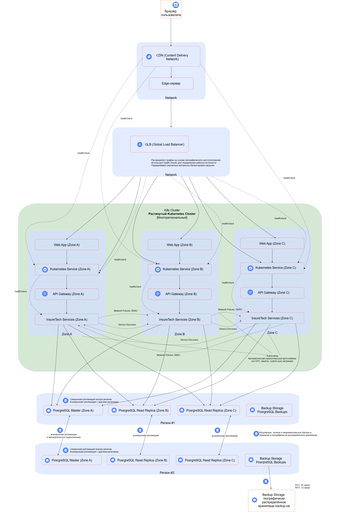

## Задание 1. Проектирование технологической архитектуры  

### Архитектура развертывания InsureTech  

Пользователь: Клиент, использующий веб-приложение InsureTech.  

CDN: Content Delivery Network для кэширования и доставки статического контента.  

Global Load Balancer: Глобальный балансировщик нагрузки для распределения трафика между регионами.  

### Инфраструктура  

Регион 1 и Регион 2: Независимые географические регионы, в которых развернуты компоненты InsureTech.  

Kubernetes Cluster:  
- **Общий кластер**: Растянутый кластер Kubernetes, охватывающий несколько зон доступности (Зона A, Зона B, Зона C) внутри каждого региона. Это обеспечивает упрощенное управление и оркестрацию, позволяя динамически распределять ресурсы между зонами в зависимости от нагрузки.  
- **Контейнеры**: Веб-приложение, API Gateway и другие сервисы InsureTech, развернутые в Kubernetes.  

### Базы данных  

**PostgreSQL Master**: Основная база данных PostgreSQL для каждого региона.  

**PostgreSQL Read Replicas**:  
- **Реплики для чтения** базы данных PostgreSQL, развернутые в различных зонах доступности (например, "PostgreSQL Read Replica (Зона B)", "PostgreSQL Read Replica (Зона C)") для повышения доступности и производительности.  

### Резервное копирование и репликация  

**Бэкапы PostgreSQL**: Процесс резервного копирования данных PostgreSQL, обеспечивающий безопасность и восстановление данных.  

**Географически распределенное хранилище**: Хранилище для резервных копий данных PostgreSQL, расположенное в разных географических регионах для повышения надежности.  

**Репликация данных**: Синхронная или асинхронная репликация данных между основными и репликами PostgreSQL в разных регионах.  

**Автоматическое переключение при сбое Master**: Механизм автоматического переключения на резервную базу данных в случае сбоя основной базы данных, что обеспечивает высокую доступность решений.  

### Архитектура развертывания InsureTech

Ссылка на схему Drawio: [InsureTech_технологическая_архитектура-to-be.drawio](InsureTech_технологическая_архитектура-to-be.drawio)

Ссылка на схему PlantUML: [InsureTech_технологическая_архитектура-to-be](InsureTech_технологическая_архитектура-to-be.puml)

**Подробное описание решения и ответы на вопросы**:  

### 1. Стратегия масштабирования и отказоустойчивости  

Стратегия: Активно-активная многорегиональная архитектура.  

#### Масштабирование  

- **Горизонтальное масштабирование**: Основной метод масштабирования в архитектуре. Kubernetes автоматически масштабирует количество контейнеров (подов) в зависимости от нагрузки. Автоскейлинг настраивается на основе метрик, таких как CPU, память и кастомные метрики, специфичные для приложения. Это позволяет динамически адаптироваться к изменениям нагрузки на систему.  

- **Вертикальное масштабирование**: В Kubernetes возможно увеличение ресурсов (CPU, память) для отдельных контейнеров, однако этот метод является менее предпочтительным. Вертикальное масштабирование требует перезапуска контейнеров и может привести к неравномерному распределению ресурсов. Кроме того, у этого подхода есть пределы, и его сложнее автоматизировать.  

#### Отказоустойчивость  

- **Многозонная архитектура**: Кластер Kubernetes развернут в нескольких зонах доступности внутри каждого региона. Это защищает от сбоев на уровне зоны и обеспечивает высокую доступность приложений.  

- **Многорегиональная архитектура**: Архитектура развернута в нескольких регионах. В случае, если один регион полностью выходит из строя, трафик автоматически перенаправляется в другой регион. Это повышает общую надежность системы и дает пользователям доступ к сервисам без значительных перерывов.  

- **Репликация данных**: Данные в базах данных PostgreSQL реплицируются между регионами, что обеспечивает их доступность и целостность при сбоях. Репликация может быть как синхронной, так и асинхронной в зависимости от требований к производительности и консистентности.  

- **Автоматическое переключение**: Система обладает механизмом автоматического переключения на резервную базу данных PostgreSQL в случае сбоя основной базы. Это гарантирует минимальные потери в случае частичного отключения сервисов.  

### 2. Конфигурация развертывания приложения в Kubernetes  

**Основной подход**: Один растянутый кластер  
Решение использовать один растянутый кластер Kubernetes, охватывающий несколько регионов, предоставляет следующие преимущества:  

- **Упрощенное управление**: Единый центр управления для всех сервисов и приложений, что упрощает процессы мониторинга и администрирования.  
- **Оптимизация использования ресурсов**: Kubernetes может динамически распределять ресурсы между регионами в зависимости от нагрузки, что способствует более эффективной работе приложений.  
- **Упрощенная оркестрация**: Упрощается развертывание, обновление и откаты приложений, что позволяет быстрее реагировать на изменения в требованиях.  
- **Service Discovery**: Сервисы могут легко находить друг друга, независимо от того, в каком регионе они развернуты, что улучшает взаимодействие между компонентами.  

**Альтернатива**: Независимые кластеры  
Развертывание отдельных кластеров Kubernetes в каждом регионе потребует более сложной настройки, но может обеспечить большую изоляцию и контроль над каждым регионом. Эта конфигурация позволяет самим регионам работать независимо, что может помочь в управлении локальными сбоями и проблемами.  

**Аргументация**:  
- В данном сценарии преимущества упрощенного управления и оркестрации перевешивают потенциальные риски, связанные с единым кластером, такие как сложности с безопасностью и сетевыми политиками.  
- Современные инструменты Kubernetes, такие как federation или multi-cluster service mesh, позволяют эффективно управлять растянутыми кластерами, обеспечивая баланс между простотой и безопасностью.

- Важно тщательно настроить network policies и RBAC в Kubernetes для защиты инфраструктуры, независимо от выбора между растянутым или независимыми кластерами.  

### 3. Балансировка нагрузки:  

- **CDN**: CDN кэширует статический контент и доставляет его пользователям с ближайшего edge-сервера, снижая нагрузку на бэкенд.  
- **Global Load Balancer**:  
  - **Распределяет трафик** между регионами на основе географического местоположения пользователя и доступности регионов.  
  - **Использует health checks** для определения работоспособности сервисов в каждом регионе. Если health check не проходит, трафик перенаправляется в другой регион.  
  - **Поддерживает различные алгоритмы** балансировки нагрузки (round-robin, weighted round-robin, least connections).  
- **Kubernetes Service**:  
  - **Внутри каждого Kubernetes кластера** Kubernetes Service обеспечивает балансировку нагрузки между подами, реализующими сервис.  
  - **Kubernetes Service** также использует health checks для определения работоспособности подов.  
- **Health Checks**:  
  - **CDN**: Проверяет доступность origin-сервера (Kubernetes Service).  
  - **Global Load Balancer**: Проверяет доступность Kubernetes Service.  
  - **Kubernetes Service**: Проверяет доступность отдельных подов.  
  - **Health checks** должны проверять не только доступность сервиса, но и его функциональность (например, возможность обработать запрос).  

### 4. Фейловер-стратегия:  

- **Global Load Balancer**: Основной механизм фейловера.  
  - **Если Global Load Balancer обнаруживает**, что регион недоступен (например, из-за сбоя сети или дата-центра), он автоматически перенаправляет трафик в другой регион.  
  - **Это обеспечивает автоматическое и быстрое переключение** на резервный регион.  
- **PostgreSQL**:  
  - **В случае сбоя основной базы данных** PostgreSQL в регионе происходит автоматическое переключение на резервную базу данных.  
  - **Это обеспечивается фреймворком**, например, Patroni, и его механизмами leader election.  

### 5. Конфигурация базы данных:  

- **Фреймворк**: Patroni (или аналогичный фреймворк для управления кластерами PostgreSQL).  
- **Репликация**:  
  - **Синхронная репликация** между зонами доступности внутри региона. Это обеспечивает высокую согласованность данных и минимизирует потери данных в случае сбоя.  
  - **Асинхронная репликация** между регионами. Это обеспечивает географическую распределенность данных и возможность быстрого восстановления после катастрофических сбоев.  
- **Резервное копирование**:  
  - **Регулярные полные и инкрементальные** бэкапы базы данных.  
  - **Хранение бэкапов** в географически распределенном хранилище (например, Cloud Storage в разных регионах).  
- **RTO и RPO**:  
  - **RTO (45 минут)**: Автоматическое переключение на резервную базу данных и восстановление сервисов Kubernetes должны занимать менее 45 минут. Это достигается автоматизацией процессов и тщательным тестированием фейловера.  
  - **RPO (15 минут)**: Максимальная потеря данных не должна превышать 15 минут. Это обеспечивается частыми бэкапами и репликацией данных.  

### 6. Шардирование БД:  

- **Не требуется (пока)**: На текущий момент с объемом данных 50 GB, шардирование БД не является необходимым. PostgreSQL может эффективно обрабатывать такой объем данных на одном сервере или кластере.  
- **В будущем**: Если объем данных значительно увеличится в будущем, можно будет рассмотреть шардирование БД. Возможные стратегии шардирования:  
  - **Range-based sharding**: Шардирование по диапазону значений (например, по идентификатору клиента).  
  - **Hash-based sharding**: Шардирование на основе хеша ключа.  
- **Отражение на схеме**: Пока что не отражено. Если в будущем потребуется, схема будет обновлена.  

**Вывод**:  

Эта архитектура обеспечивает высокую доступность, масштабируемость и отказоустойчивость, необходимые для поддержки роста InsureTech и обслуживания клиентов по всей России. Регулярное тестирование и мониторинг необходимы для обеспечения соответствия требованиям RTO, RPO и доступности. Использование Infrastructure as Code (IaC) упростит управление и автоматизацию развертывания.  
