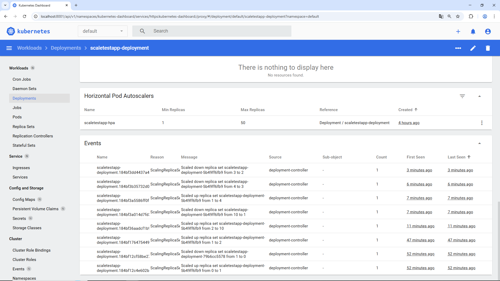
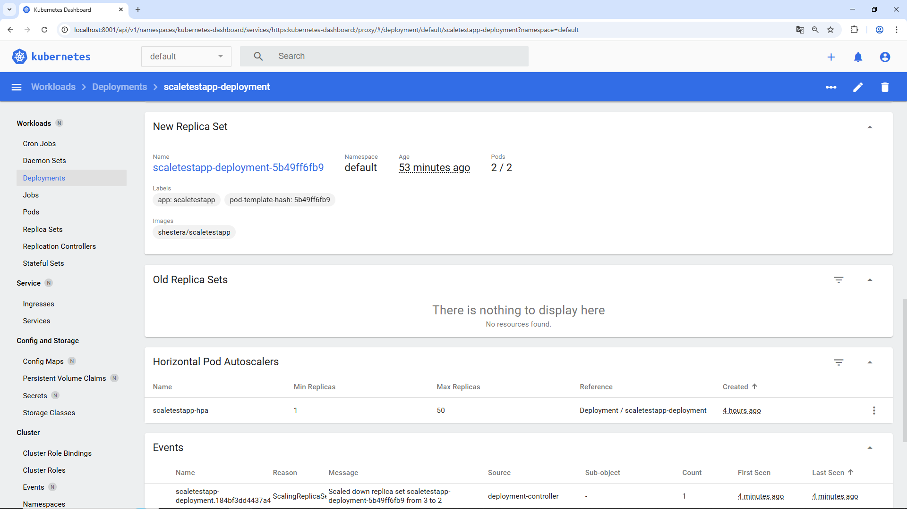
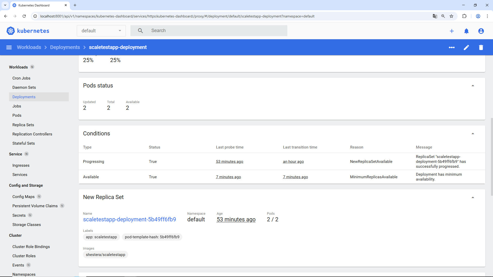
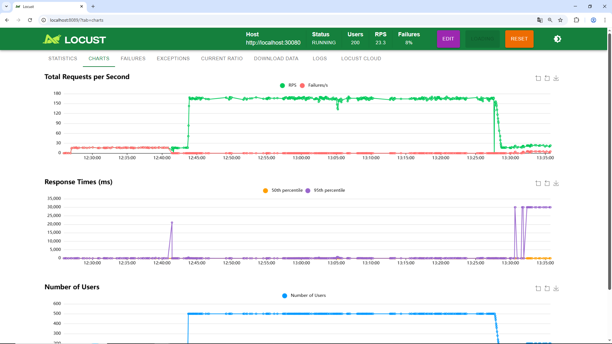
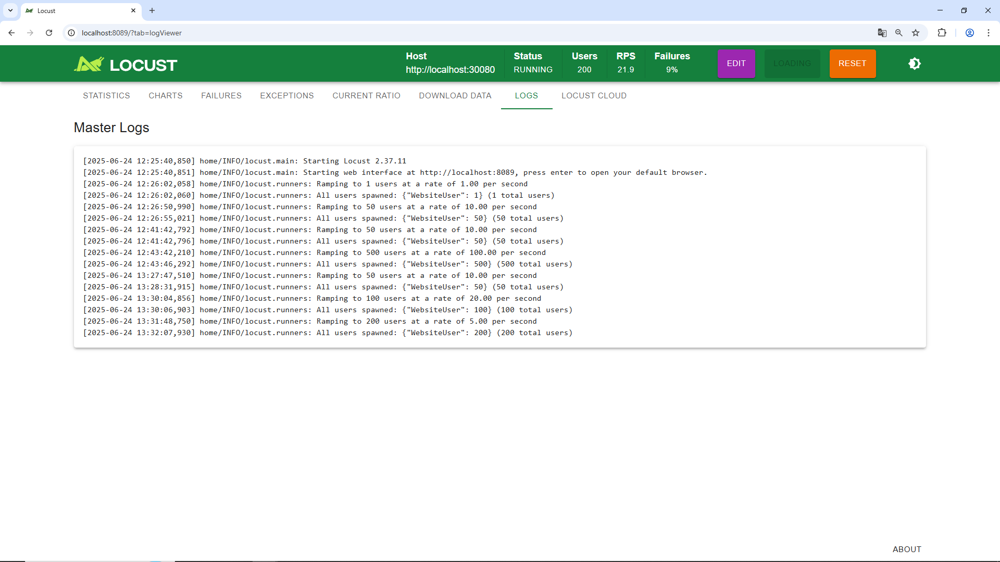
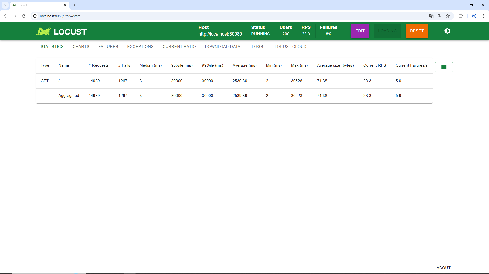

## Задание 2. Динамическое масштабирование контейнеров

1. Подготовка окружения:

- **Установить Minikube**: https://minikube.sigs.k8s.io/docs/start/  
- **Установить kubectl**: https://kubernetes.io/docs/tasks/tools/  
- **Установить Locust**: pip install locust  

2. Запуск Minikube и активация Metrics Server:

```
minikube start --cpus=4 --memory=8g #Выделяем ресурсы для minikube
minikube addons enable metrics-server
```

3. Манифест Deployment ([deployment.yaml](deployment.yaml)):

```
apiVersion: apps/v1
kind: Deployment
metadata:
  name: scaletestapp-deployment
  labels:
    app: scaletestapp
spec:
  replicas: 1
  selector:
    matchLabels:
      app: scaletestapp
  template:
    metadata:
      labels:
        app: scaletestapp
    spec:
      containers:
      - name: scaletestapp
        image: ghcr.io/yandex-practicum/scaletestapp:latest
        ports:
        - containerPort: 8080
        resources:
          limits:
            memory: "30Mi"
```

4. Манифест Service ([service.yaml](./service.yaml)):

```
apiVersion: v1
kind: Service
metadata:
  name: scaletestapp-service
spec:
  selector:
    app: scaletestapp
  ports:
    - protocol: TCP
      port: 80
      targetPort: 8080
  type: NodePort #Используем NodePort для доступа извне Minikube
```

5. Манифест Horizontal Pod Autoscaler ([hpa.yaml](./hpa.yaml)):

```
apiVersion: autoscaling/v2beta2
kind: HorizontalPodAutoscaler
metadata:
  name: scaletestapp-hpa
spec:
  scaleTargetRef:
    apiVersion: apps/v1
    kind: Deployment
    name: scaletestapp-deployment
  minReplicas: 1
  maxReplicas: 10
  metrics:
  - type: Resource
    resource:
      name: memory
      target:
        type: Utilization
        averageUtilization: 80
```

6. Применение манифестов:

```
kubectl apply -f deployment.yaml
kubectl apply -f service.yaml
kubectl apply -f hpa.yaml
```

7. Установка Locust:

```
pip install locust
```

8. Locustfile ([locustfile.py](./locustfile.py)):

```
from locust import HttpUser, between, task

class WebsiteUser(HttpUser):
    wait_time = between(1, 5)

    @task
    def index(self):
        self.client.get("/")
```

9. Запуск Locust:

```
locust -H http://$(minikube service scaletestapp-service --url) #Запускаем locust, указывая URL приложения
```

10. Настройка и запуск Locust в браузере:

- В браузере по ссылке http://localhost:8089.  
- Указываем:  
  - **Number of users to simulate**: 50 (или больше, чтобы создать нагрузку).  
  - **Hatch rate**: 10 (пользователей в секунду).  
- Нажимаем "Start swarming".  

11. Ссылки на файлы конфигурации:

- [admin-user.yaml](./admin-user.yaml): Файл конфигурации для создания пользователя-администратора с соответствующими правами доступа в кластере Kubernetes.

- [metrics-server.yaml](./metrics-server.yaml): Конфигурация для установки Metrics Server, который собирает и предоставляет метрики ресурсов (CPU и памяти) для кластеров Kubernetes.

12. **Просмотр результатов в Kubernetes Dashboard**:

- Запускаем Kubernetes Dashboard с помощью команды: `minikube dashboard`.

- В раздел "Deployments" выбираем `scaletestapp-deployment`.



- Обращаем внимание на количество реплик. Оно увеличивается по мере роста нагрузки, генерируемой Locust, и достигает целевого значения (максимум 10).  



- Также в разделе HPA можно посмотреть информацию о текущей утилизации памяти и целевых показателях.  



**Обзор результатов нагрузочного тестирования с помощью Locust**:

- Графики производительности можно просмотреть в разделе отчетов Locust.



- Логи Locust предоставят дополнительную информацию о прохождении тестов.



- Статистика поможет оценить общую производительность приложения.



Объяснение:  

Данная инструкция создает Deployment, Service и HPA для тестового приложения. HPA настроен на автоматическое масштабирование Deployment на основе утилизации памяти. Locust генерирует нагрузку, что приводит к увеличению утилизации памяти приложения. HPA автоматически увеличивает количество реплик, чтобы поддерживать утилизацию памяти на уровне 80%. Dashboard Kubernetes отображает изменения в количестве реплик. Выполнение этой инструкции позволит понять, как работает динамическое масштабирование в Kubernetes.  

## Детальное выполнение дополнительной части задания 2: Динамическое масштабирование на основе RPS  

В процессе...  