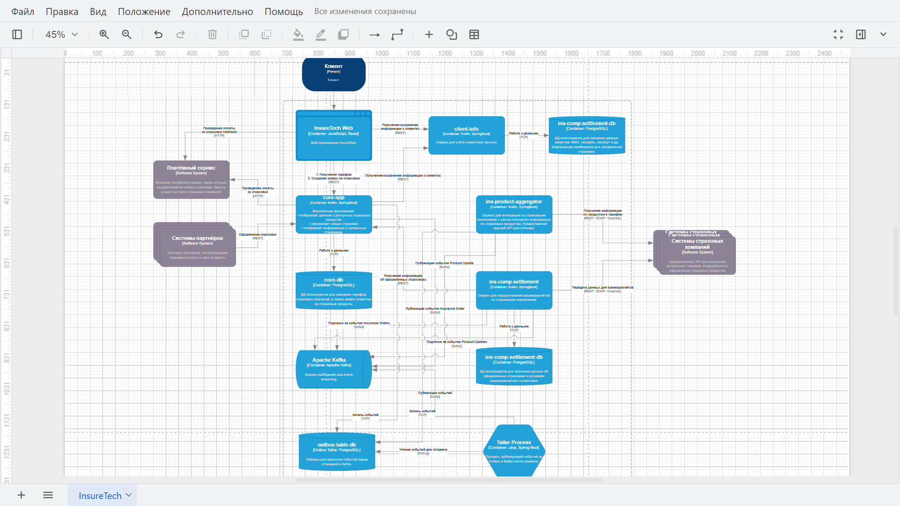

## Задание 3. Переход на Event-Driven архитектуру  

### 1. Анализ текущей архитектуры: Проблемы и риски при росте нагрузки  

Список проблем и рисков, связанных с планируемым ростом нагрузки, для InsureTech:  

1. **Синхронные вызовы и задержки**:  
  •  Проблема: Сервисы `core-app` и `ins-comp-settlement` полагаются на синхронные вызовы к `ins-product-aggregator` для получения данных о продуктах и тарифах. `ins-product-aggregator` в свою очередь выполняет синхронные вызовы к API страховых компаний (сейчас 5, планируется 10).  
  •  Риск:  
    *  Увеличение времени ответа: Время ответа `ins-product-aggregator` будет увеличиваться с добавлением новых страховых компаний. Это приведет к замедлению работы `core-app` и `ins-comp-settlement` и ухудшению пользовательского опыта.  
    *  Таймауты: Увеличение времени ответа может привести к таймаутам запросов между сервисами, вызывая ошибки и нестабильность системы.  
    *  Связанность: Сервисы становятся сильно связанными, что затрудняет их независимую разработку и развертывание.  
2. **Локальные реплики данных и несогласованность**:  
  •  Проблема: Сервисы `core-app` и `ins-comp-settlement` хранят локальные реплики данных о продуктах и тарифах, которые обновляются с разной периодичностью (15 минут и сутки).  
  •  Риск:  
    *  Несогласованность данных: Локальные реплики могут быть неактуальными, что приводит к отображению неверной информации пользователям и ошибкам при расчетах.  
    *  Сложность управления: Поддержка локальных реплик усложняет архитектуру и требует дополнительных усилий по обеспечению согласованности данных.  
3. **Запрос данных о страховках из `core-app`**:  
  •  Проблема: Сервис `ins-comp-settlement` выполняет запрос к `core-app` для получения всех оформленных за день страховок.  
  •  Риск:  
    *  Нагрузка на `core-app`: Этот запрос может создавать значительную нагрузку на `core-app`, особенно при большом количестве оформленных страховок.  
    *  Временные задержки: Запрос может задерживаться при высокой нагрузке на `core-app`.  
4. **Ограниченная масштабируемость**:  
  •  Проблема: Текущая архитектура с монолитным `core-app` и синхронными вызовами имеет ограниченную масштабируемость.  
  •  Риск:  
    *  Невозможность обработки возрастающей нагрузки: Система может не справиться с возрастающим количеством пользователей и запросов, что приведет к снижению производительности и доступности.  
5. **Отказоустойчивость**:  
   * Проблема: Зависимость многих сервисов от `ins-product-aggregator`. Сбой в этом сервисе может повлечь за собой проблемы во всей системе.  
   * Риск: Снижение отказоустойчивости системы и влияние на бизнес-процессы.  
6. **Увеличение количества страховых компаний**:  
  •  Проблема: Увеличение количества страховых компаний (с 5 до 10) усугубит существующие проблемы с производительностью и масштабируемостью `ins-product-aggregator`.  
  •  Риск: `ins-product-aggregator` станет узким местом системы.  
  
### 2. Обновленная диаграмма контейнеров InsureTech с Event-Streaming:

1. Это диаграмма контейнеров C4 для архитектуры системы InsureTech.  
  
     

2. [InsureTech_C4_сontainer-diagram.drawio.xml](InsureTech_C4_сontainer-diagram.drawio.xml)  
   XML-файл, содержащий исходные данные диаграммы контейнеров.

3. [Схема в PlantUML](schema.puml)  
   Эта же схема представлена в формате PlantUML для визуализации архитектуры системы.

```
@startuml
!include https://raw.githubusercontent.com/plantuml-stdlib/C4-PlantUML/master/C4_Container.puml

LAYOUT_WITH_LEGEND()

title Обновленная диаграмма контейнеров для системы InsureTech с использованием Transactional Outbox и Kafka

Person(client, "Клиент", "Клиент")

System_Boundary(insureTechProd, "InsureTech Prod") {
    Container(web_app, "insuretech-web", "JavaScript, React", "Веб-приложение InsureTech")
    Container(client_info_service, "client-info", "Kotlin, SpringBoot", "Сервис для учёта клиентских данных")
    Container(database_client, "ins-comp-settlement-db", "PostgreSQL", "БД для хранения данных клиентов: ФИО, телефон, паспорт и др.")
    Container(core_app, "core-app", "Kotlin, SpringBoot", "Монолитное приложение:\n - отображает данные о доступных страховых продуктах\n - оформляет новые страховки\n - отображает информацию о купленных страховках")
    Container(product_aggregator, "ins-product-aggregator", "Kotlin, SpringBoot", "Сервис для интеграции со страховыми компаниями с целью получения информации по страховым продуктам.")
    Container(database_rates, "core-db", "PostgreSQL", "БД для хранения тарифов страховых компаний, а также заявок клиентов на страховые продукты.")
    Container(settlement_service, "ins-comp-settlement", "Kotlin, SpringBoot", "Сервис для осуществления взаиморасчётов со страховыми компаниями.")
    Container(kafka, "Kafka", "Apache Kafka", "Брокер сообщений для event-streaming.")
    Container(outbox, "Outbox Table", "PostgreSQL", "Таблица для хранения событий перед отправкой в Kafka.")
    Container(tailer_process, "Tailer Process", "Java, Spring Boot", "Процесс, публикующий события из Outbox в Kafka после коммита.")
}

System_Ext(partner_systems, "Системы партнёров", "Программная система\nСистемы партнёров, интегрирующие страховые услуги в свои продукты.")
System_Ext(payment_service, "Платёжный сервис", "Программная система\nВнешний платёжный сервис, через который осуществляется оплата страховок.")
System_Ext(insurance_systems, "Системы страховых компаний", "Программная система\nПредоставляют API для получения актуальных тарифов, андерайтинга и оформления страховых продуктов.")

Rel(client, web_app, "Использует (Взаимодействует посредством)")
Rel(web_app, payment_service, "Проведение оплаты за страховки (redirect)", "HTTP")
Rel(core_app, payment_service, "Проведение оплаты за страховки", "HTTP")

Rel(web_app, core_app, "1. Получения тарифов\n2. Создание заявок на страховки", "REST")
Rel(web_app, client_info_service, "Получение/сохранение информации о клиентах", "REST")

Rel(client_info_service, database_client, "Работа с данными", "TCP")

Rel(core_app, database_rates, "Работа с данными", "TCP")
Rel(core_app, client_info_service, "Получение/сохранение информации о клиентах", "REST")

Rel(core_app, outbox, "Запись событий", "TCP")
Rel(product_aggregator, outbox, "Запись событий", "TCP")
Rel(tailer_process, outbox, "Чтение событий для отправки", "Polling")

Rel(tailer_process, kafka, "Публикация событий", "Kafka")
Rel(core_app, kafka, "Публикация события Insurance Order", "Kafka")

Rel(settlement_service, kafka, "Подписка на события Insurance Orders", "Kafka")
Rel(settlement_service, kafka, "Подписка на события Product Updates", "Kafka")
Rel(product_aggregator, kafka, "Публикация события Product Update", "Kafka")

Rel(settlement_service, database_client, "Работа с данными", "TCP")
Rel(settlement_service, insurance_systems, "Передача данных для взаиморасчётов", "REST, SOAP, GraphQL")

Rel(partner_systems, core_app, "Оформление страховок", "REST")

@enduml
```

### Описание изменений и обоснование:  

1. **Введение Kafka**:  
  •  Добавлен контейнер `Kafka` для реализации event-streaming. Kafka будет использоваться как брокер сообщений для асинхронного взаимодействия между сервисами.  
  •  Два основных топика: `Product Updates` и `Insurance Orders`.  

2. **Замена REST на Event-Streaming для данных о продуктах**:  
  •  Сервис `InsProductAggregator` больше не вызывается синхронно сервисами `core-app` и `ins-comp-settlement`. Вместо этого, он публикует событие `Product Update` в Kafka каждый раз, когда происходят изменения в данных о продуктах и тарифах.  
  •  Сервисы `core-app` и `ins-comp-settlement` подписываются на топик `Product Updates` и обновляют свои локальные реплики данных при получении события.  

3. **Замена REST на Event-Streaming для данных о страховых полисах**:  
  •  Сервис `CoreApp` публикует событие `Insurance Order` в Kafka после оформления нового страхового полиса.  
  •  Сервис `InsCompSettlement` подписывается на топик `Insurance Orders` и обрабатывает эти события для взаиморасчетов.  

4. **Паттерн Transactional Outbox**:  
  •  `InsProductAggregator` и `CoreApp` используют паттерн `Transactional Outbox`. Это гарантирует, что событие будет опубликовано в Kafka только после успешного сохранения данных в базе данных.  
  •  В таблице БД создается дополнительная таблица, в которую в рамках транзакции записываются события, которые нужно отправить в Kafka. Отдельный процесс (`Tailer Process`), запущенный после коммита транзакции, публикует эти события в Kafka.  

5. **Удаление ненужных REST-вызовов**:  
  •  Удален REST-вызов из `InsCompSettlement` в `CoreApp` для получения информации об оформленных страховых полисах. Теперь эту информацию `InsCompSettlement` получает из Kafka.  
  •  Удалены REST-вызовы из `CoreApp` и `InsCompSettlement` в `InsProductAggregator` для получения информации о продуктах. Теперь эту информацию сервисы получают из Kafka.  

### Обоснование решений:  

•  **Event-Streaming**: Решает проблему синхронных вызовов, снижает связанность между сервисами, повышает масштабируемость и отказоустойчивость. Сервисы могут работать асинхронно и независимо друг от друга. При добавлении новых страховых компаний, `ins-product-aggregator` может обрабатывать запросы асинхронно и публиковать обновления в Kafka, не блокируя другие сервисы.  
•  **Паттерн Transactional Outbox**: Гарантирует надежную доставку событий в Kafka и консистентность данных.  
•  **Kafka**: Выбран как надежная и масштабируемая платформа для event-streaming.  
•  **Удаление REST-вызовов**: Упрощает архитектуру и повышает производительность.  

**Преимущества**:  

•  **Повышенная масштабируемость**: Сервисы могут масштабироваться независимо друг от друга.  
•  **Улучшенная отказоустойчивость**: Сбой в одном сервисе не влияет на работу других сервисов.  
•  **Снижение связанности**: Сервисы взаимодействуют асинхронно, что упрощает их разработку и развертывание.  
•  **Согласованность данных**: Паттерн `Transactional Outbox` гарантирует доставку событий в Kafka и консистентность данных.  
•  **Более быстрая интеграция с новыми страховыми компаниями**: `InsProductAggregator` может обрабатывать запросы от новых страховых компаний асинхронно.  

**Недостатки**:  

•  Усложнение архитектуры.  
•  Необходимость внедрения Kafka и управления им.  
•  Возможная задержка в доставке событий.  
•  Необходимость обработки дубликатов сообщений.  

**Заключение**:  

Предложенная архитектура с использованием event-streaming на базе Kafka решает проблемы, связанные с синхронными вызовами, локальными репликами данных и ограниченной масштабируемостью. Она обеспечивает более надежную, масштабируемую и отказоустойчивую систему, готовую к росту нагрузки и интеграции с новыми страховыми компаниями. Необходимо учитывать возможные недостатки и принять меры для их минимизации.  

