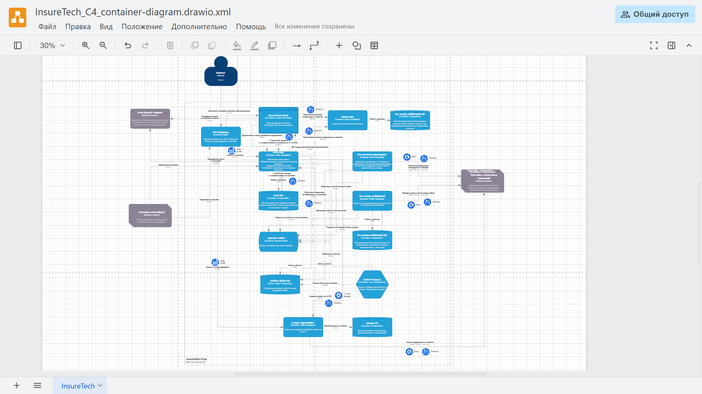

## Задание 4. Проектирование продажи ОСАГО  

### Описание:  

Данное решение описывает архитектуру и компоненты, необходимые для онлайн оформления ОСАГО, учитывая требования бизнеса и существующую архитектуру InsureTech. Основной фокус сделан на сервисе `osago-aggregator`, а также на интеграции между различными компонентами системы.  

1. **Osago-Aggregator**:  
  •  **Необходимость хранилища данных**:  Да, требуется. `osago-aggregator` необходимо хранить информацию о статусе заявок, идентификаторах заявок в страховых компаниях, а также полученные предложения. Это позволит:  
    *  Асинхронно опрашивать страховые компании о статусе заявок.  
    *  Восстанавливать состояние при перезапуске сервиса.  
    *  Предоставлять данные для аналитики и мониторинга.  
    *  Избежать повторной отправки одной и той же заявки в страховую компанию (используя дедупликацию по уникальному идентификатору заявки).  

    Рекомендуется использовать `PostgreSQL`, как и в других сервисах, для унификации используемых технологий.  

  •  **API для core-app**:  `osago-aggregator` предоставляет REST API для `core-app`:  
    *  **POST /osago-applications**: Создание заявки на ОСАГО.  
        Запрос: Информация об автомобиле и клиенте.  
        Ответ:  `applicationId` (уникальный идентификатор заявки в `osago-aggregator`).  
    *  **GET /osago-applications/{applicationId}**:  Получение текущего состояния заявки и предложений.  
        Ответ:  JSON с информацией о статусе заявки и массивом предложений от страховых компаний. Каждое предложение содержит информацию о компании, цене, условиях и т.д.  Может возвращать частичные данные (по мере поступления от страховых компаний).  

  •  **Интеграция между core-app и osago-aggregator**:  REST (синхронный). Учитывая, что `core-app` должно отображать предложения сразу после их получения, синхронный REST является подходящим вариантом.  Для повышения отказоустойчивости использовать `Circuit Breaker` и `Timeout` на стороне `core-app` при вызовах к `osago-aggregator`.  

2. **API для веб-приложения в core-app**:  

  •  **Server-Sent Events (SSE)**: Для обновления информации о предложениях в реальном времени на веб-приложении рекомендуется использовать `Server-Sent Events (SSE)`. SSE обеспечивает одностороннюю связь от сервера к клиенту, что идеально подходит для отправки обновлений по мере их поступления.  

  •  **GET /osago-applications/{applicationId}/stream**:  Подключение к потоку событий для получения обновлений по заявке.  Формат событий:  JSON с информацией о новых или обновленных предложениях.  

  •  **POST /osago-applications**: Создание заявки (в `core-app`).  

3. **Интеграция между веб-приложением и core-app**:  

  •  **SSE**: Для получения обновлений.  
  •  **REST**: Для первоначального запроса и создания заявки.  

4. **Паттерны отказоустойчивости**:  

  •  **Rate Limiting**: Применяется на `API Gateway` (или `Ingress` контроллере) для защиты `osago-aggregator` и `core-app` от перегрузки, особенно учитывая потенциально высокую нагрузку (2500 пользователей).  
  •  **Circuit Breaker**: Применяется на `core-app` при вызовах к `osago-aggregator`.  Если `osago-aggregator` недоступен или отвечает с ошибками, `Circuit Breaker` предотвратит дальнейшие попытки вызова и позволит системе работать в штатном режиме.  
  •  **Retry**: Применяется на `osago-aggregator` при вызовах к API страховых компаний.  В случае временных сбоев (например, сетевых проблем) `Retry` позволит повторить запрос.  Важно настроить параметры `Retry` (количество попыток, интервал между попытками) таким образом, чтобы не перегружать API страховых компаний.  
  •  **Timeout**:  Применяется на всех синхронных вызовах между сервисами (особенно между `osago-aggregator` и страховыми компаниями). `Timeout` предотвращает зависание запросов и позволяет системе вовремя реагировать на проблемы.  `Timeout` также применяется на `core-app` при вызовах к `osago-aggregator`.  

5. **Множественные экземпляры сервисов**:  

•   Все сервисы развернуты в нескольких экземплярах для обеспечения высокой доступности и масштабируемости.  
•   **Load Balancer** (например, `Ingress Controller` в Kubernetes) распределяет нагрузку между экземплярами сервисов.  

•   Для `Kafka` необходимо настроить правильную конфигурацию `Consumer Groups`, чтобы экземпляры `InsCompSettlement` и `CoreApp` могли параллельно обрабатывать события.  
•   Можно использовать распределенный кэш (например, `Redis`) для хранения сессий пользователей, чтобы любой экземпляр `core-app` мог обработать запрос пользователя.  
  
1.   
   Диаграмма контейнеров C4 для архитектуры системы InsureTech.

2. [InsureTech_C4_сontainer-diagram.drawio.xml](InsureTech_C4_сontainer-diagram.drawio.xml)  
   XML-файл, содержащий исходные данные диаграммы контейнеров.

3. [Схема в PlantUML](schema.puml)  
   Эта же схема представлена в формате PlantUML для визуализации архитектуры системы.

**Диаграмма (PlantUML)**:  

```
@startuml
!includeurl https://raw.githubusercontent.com/RicardoNiepel/C4-PlantUML/master/C4_Context.puml
!includeurl https://raw.githubusercontent.com/RicardoNiepel/C4-PlantUML/master/C4_Container.puml
!includeurl https://raw.githubusercontent.com/RicardoNiepel/C4-PlantUML/master/C4_Component.puml

LAYOUT_TOP_DOWN()
LAYOUT_WITH_LEGEND()

System_Ext(ClientPerson, "Клиент", "Пользователь веб-сайта InsureTech")
System_Ext(PartnerSystems, "Системы партнёров", "Системы партнёров, интегрирующие страховые услуги")
System_Ext(PaymentSystem, "Платёжный сервис", "Внешний платёжный сервис для оплаты страховок")
System_Ext(InsuranceCompanies, "Системы страховых компаний", "Системы, предоставляющие API для актуальных тарифов")

System(InsureTech, "InsureTech Prod", "Виртуальная машина для системы InsureTech") {
  Container(WebApp, "Веб-приложение InsureTech", "JavaScript, React", "Веб-приложение для страхования")
  Container(CoreApp, "Монолитное приложение", "Kotlin, SpringBoot", "Монолитное приложение для страховок")
  Container(ClientInfoService, "Сервис для учёта клиентских данных", "Kotlin, SpringBoot", "Сервис для учета клиентских данных")
  ContainerDb(DatabaseClientInfo, "База данных для хранения данных клиентов", "PostgreSQL", "БД для хранения данных клиентов")
  Container(InsProductAggregator, "Сервис для интеграции с компаниями", "Kotlin, SpringBoot", "Сервис для интеграции с компаниями")
  ContainerDb(DatabaseRates, "База данных для хранения тарифов и заявок", "PostgreSQL", "БД для хранения тарифов и заявок")
  Container(InsCompSettlement, "Сервис для взаиморасчётов", "Kotlin, SpringBoot", "Сервис для взаиморасчётов с компаниями")
  ContainerDb(DatabaseSettlement, "База данных для хранения данных о страховках", "PostgreSQL", "БД для хранения данных об оформленных страховках")
  Container(Kafka, "Kafka", "Kafka", "Event Streaming Platform")
  Container(OsagoAggregator, "Osago Aggregator", "Kotlin, SpringBoot", "Сервис для агрегации предложений ОСАГО от страховых компаний")
  ContainerDb(DatabaseOsago, "База данных Osago", "PostgreSQL", "БД для хранения заявок и предложений ОСАГО")
}

Rel(ClientPerson, WebApp, "Использует (Взаимодействует посредством)")
Rel(PartnerSystems, CoreApp, "Интегрирует страховые услуги")
Rel(PaymentSystem, WebApp, "Проведение оплаты за страховки [HTTP]")

Rel(WebApp, CoreApp, "Получает данные, создает заявку [REST]")
Rel(WebApp, CoreApp, "Обновления в реальном времени [SSE]")

Rel(ClientInfoService, DatabaseClientInfo, "Работа с данными [TCP]")

Rel(CoreApp, PaymentSystem, "Проведение оплаты за страховки [HTTP]")
Rel(CoreApp, ClientInfoService, "Получение/сохранение информации о клиентах [REST]")

Rel(CoreApp, Kafka, "Публикует событие Insurance Order [AMQP]")
Rel(CoreApp, OsagoAggregator, "Создание заявки, получение предложений [REST]"){
  Use_Timeout()
  Use_CircuitBreaker()
}

Rel(InsCompSettlement, DatabaseSettlement, "Работа с данными [TCP]")
Rel(InsCompSettlement, Kafka, "Подписывается на событие Insurance Order [AMQP]")

Rel(InsProductAggregator, InsuranceCompanies, "Получение информации по продуктам и тарифам [REST, SOAP, GraphQL]")
Rel(InsProductAggregator, Kafka, "Публикует событие Product Update [AMQP]")

Rel(Kafka, CoreApp, "Подписывается на событие Product Update [AMQP]")
Rel(Kafka, InsCompSettlement, "Подписывается на событие Product Update [AMQP]")
Rel(Kafka, InsCompSettlement, "Подписывается на событие Insurance Order [AMQP]")

Rel(OsagoAggregator, InsuranceCompanies, "Получение предложений ОСАГО [REST]"){
  Use_Retry()
  Use_Timeout()
}
Rel(OsagoAggregator, DatabaseOsago, "Работа с данными [TCP]")

note right of Kafka : Topic "Product Updates"\nTopic "Insurance Orders"

note right of InsProductAggregator: Transactional Outbox Pattern\nСохранение в БД и публикация события
note right of OsagoAggregator: Получение предложений от страховых компаний

@enduml
```

**Пояснения к диаграмме**:  

•  Добавлен контейнер `OsagoAggregator` и `DatabaseOsago`.  
•  Показаны взаимодействия между `WebApp`, `CoreApp` и `OsagoAggregator` (REST и SSE).  
•  Указаны паттерны отказоустойчивости (Timeout, Circuit Breaker, Retry).  

**Заключение**:  

Данное решение обеспечивает масштабируемую и отказоустойчивую систему для онлайн оформления ОСАГО, учитывая требования бизнеса и существующую архитектуру. Использование `osago-aggregator` позволяет отделить логику взаимодействия со страховыми компаниями от `core-app`, а применение паттернов отказоустойчивости повышает надежность системы. `Server-Sent Events (SSE)` обеспечивает отображение данных в реальном времени на стороне клиента.  
